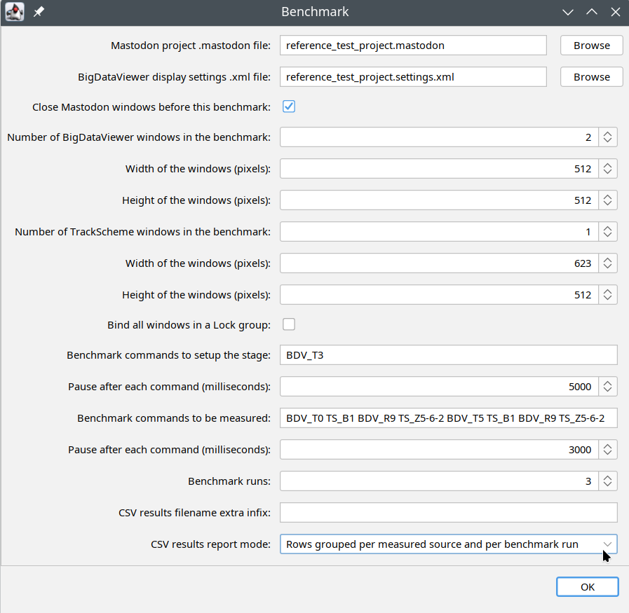

# Mastodon-Benchmark Project

## About

This is a benchmark of the rendering performance of lineage visualizations in both the BigDataViewer and TrackScheme displays of Mastodon to quantitatively assess responsiveness and determine usability limits across different datasets and rendering configurations.

This benchmark is made available directly in Fiji, users can easily evaluate the performance of their own hardware and can determine the project sizes it can handle comfortably.

## Implementation

*...just very briefly.*

The Mastodon benchmark is implemented in a straightforward manner. A sampling timestamp is recorded immediately before a drawing request is issued to either BigDataViewer or TrackScheme, and again after the rendering is finished, essentially a stopwatch-based approach. The elapsed time between these two points represents the gross (or wall-clock) time needed to complete the request and is the value reported in the benchmark. This measurement reflects the actual user experience, as it includes potential delays caused by external factors such as operating system multitasking. It is, however, recommended that the computer remain untouched while the benchmark is running.

Implementing the benchmark required modifications to both the Mastodon and BigDataViewer codebases. Consequently, the Fiji update site with this benchmark replaces the default BigDataViewer in the Fiji installation, which may affect other plugins that rely on it.

## Reproducibility

To ensure both flexibility and reproducibility, a dedicated benchmark command language was developed for Mastodon. This language allows users to define a sequence of commands, each instructing one or more display windows to render a specific view of the data.

The commands are executed sequentially, with each new command issued only after the previous rendering is complete. The rendering time for each command is recorded and reported. For consistency and performance measurement, standard Mastodon commands are executed without animation, ensuring that each requested view is established in a single rendering pass.

👉 That way, comparable performance measurements of Mastodon rendering performance can be achieved by instructing the benchmark with the same fixed command sentence to be operated on the same fixed input mastodon project (data).

## Authors
- [Vladimír Ulman](https://orcid.org/0000-0002-4270-7982), some ideas and conceptual contributions, and development
- [Johannes Girstmair](https://orcid.org/0000-0001-9029-3625), great ideas and conceptual contributions, and testing
